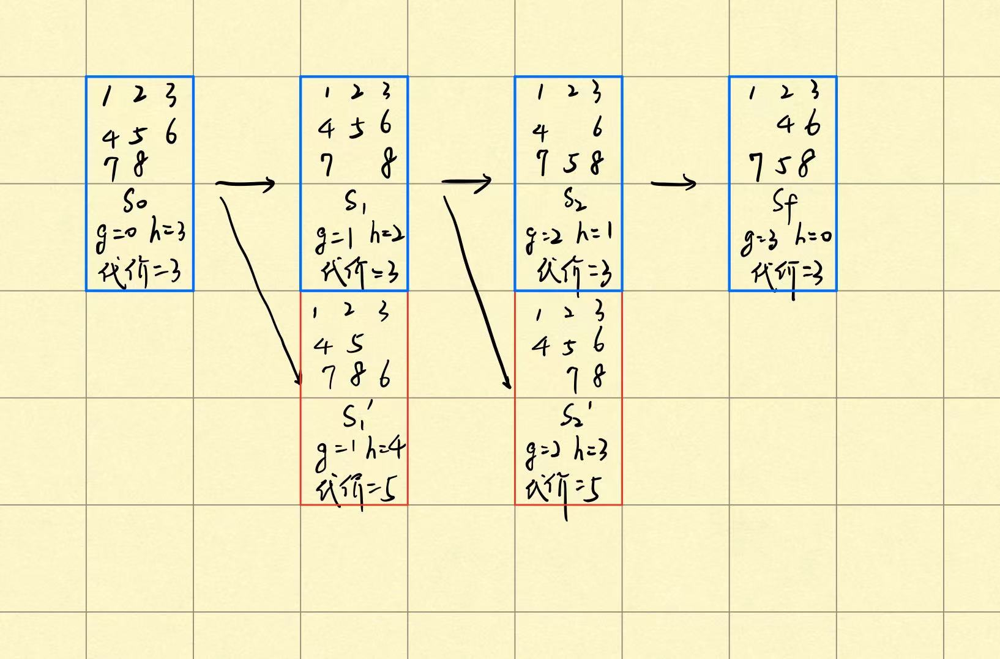
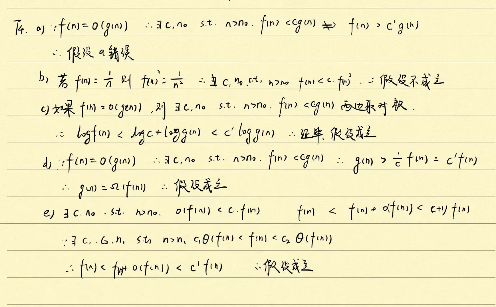

### T1

##### a)

状态：棋子的坐标；行动：坐标改变（按照象棋规则走子）

初始状态：(8, 3)；目标状态：(6, 1)

路径：(8, 3)->(9, 5)->(7, 4)->(8, 2)->(6, 1)

##### b)

状态：三个容器中的水量；行动：将任意容器装满水，清空或是转移

初始状态：(0, 0, 0)；目标状态：(0, 0, 1)或(1, 0, 0)或(0, 1, 0)

(0, 0, 0) -> (12, 0, 0) -> (4, 8, 0) -> (1, 8, 3) -> (1, 0, 0)

### T2

g函数为初始状态到当前状态的真实路径代价；h函数为从当前状态转移到目标状态的曼哈顿距离；代价函数为g函数与h函数的加和。

### T4

