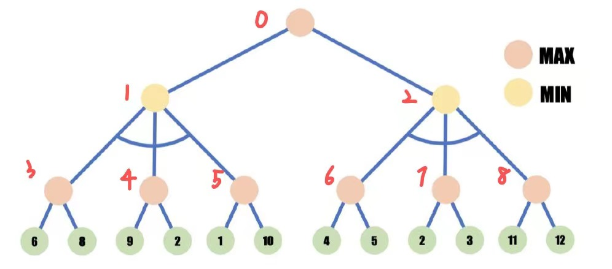
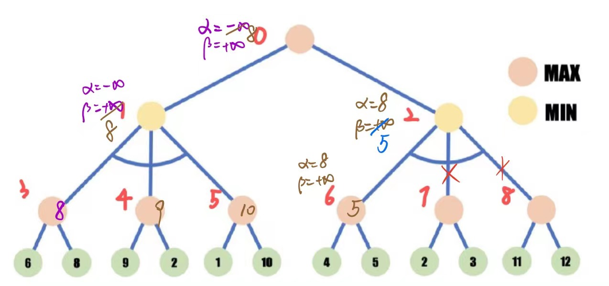
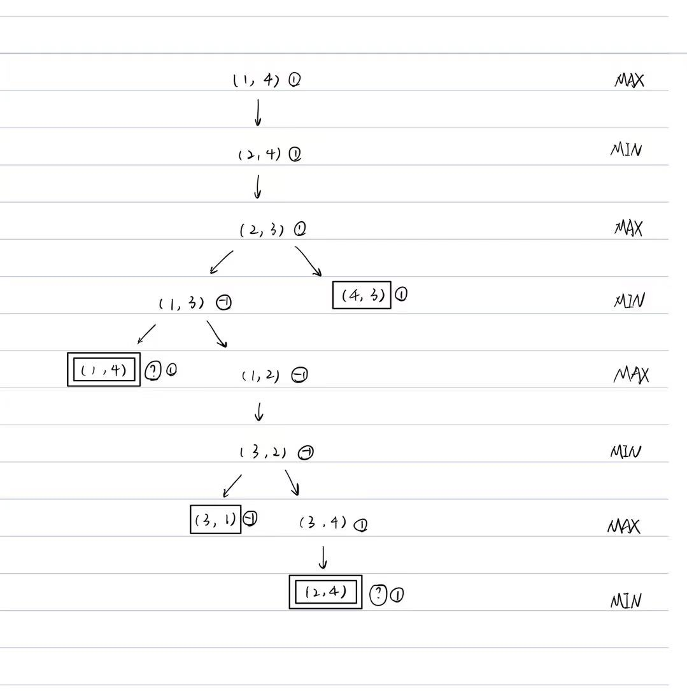

### T1

1. 建模：

   假设$A, B, C, D$的光源强度分别为$4, 3, 2, 1$，则有：

   状态变量：$X = \{x_1, x_ 2, x_3, x_4, x_5\}$， $x_i$分别为编号为$1-5$的空间内的光源强度；

   值域：$D = x_i\in\{1, 2, 3, 4\}$

2. 一元约束：$C_1 = \{\exists x_i = 2\}\&\{x_2 \neq 4, x_3 \neq 3, 4, x_4 \neq 3, 4\}$

   二元约束：$ C_2 = \left\{ \begin{aligned} 4 & =  max\{x_1, x_2\}, \\ 3 & = max\{x_2, x_3\}, \\ 2 & = max\{x_3, x_4\}, \\ 4 & = max\{x_4, x_5\};  \end{aligned} \right. $

3. 根据二元约束的条件可知，在当前条件下一元约束自动满足，所以根据边相容对变量进行值域缩小，结果如下：

   $\{x_ 1 = \{1, 2, 3, 4\}, x_2 = \{1, 2, 3\}, x_3  = \{1, 2\}, x_4 = \{1, 2\}, x_5 = \{1, 2, 3, 4\}$

4. 共有三个解，如下所示：

   $Y_1 = \{4, 3, 1, 2, 4\}$

   $Y_2 = \{4, 3, 2, 2, 4\} $

   $Y_3 = \{4, 3, 2, 1, 4\}$

### T3

由于节点的生成顺序是从上到下，从左到右，先对节点进行标号如下：

下面进行$\alpha - \beta$剪枝：

首先从根结点出发，向左向下展开至**3**号节点：

**3**号节点的值为8，更新**1**号节点$\alpha = =-\infin, \beta = 8$；

**4**号节点的值为9，**5**号节点的值为10，均不更新；

从**1**号节点返回到**0**号节点，并更新**0**号节点$\alpha = 8, \beta = +\infin$；

从**0**号节点再次出发，抵达**6**号节点，**6**号节点的值为5，故更新**2**号节点$\alpha = 8, \beta = 5$；

因为此时**2**号节点的$\alpha > \beta$所以剪掉**2**号节点的剩余所有子节点，剪枝完成。

剪枝结果及推导过程如下图所示：

$\alpha - \beta$剪枝可以从理论上将搜索树的分支因子由$b$降低为$b / 2$，由此可以提升大约两倍的搜索效率。

### T4

1. 

2. 我采用已经推导出的相同状态的值来代替"?"值，在此之前，选用一个$\epsilon \in (-1, 1)$来暂代该节点值。因为该相同节点可以视为一颗新的博弈树的根节点；而同时，由于本题中博弈结果的二值化（即只有可能为1或-1），因此该节点的"?"值必定为1或-1。因此，可以先将该值模糊处理，之后计算得到最先出现的相同状态下的博弈值，并认为这个过程应当是无记忆的，因此再将“？”值认为等于该值即可。

3. 因为严格来讲，包含已出现状态的博弈树是一个连通图，具有循环路径的博弈树并不能在有限时间内通过常规方法完成生成与计算，因此就无法通过标准的极大极小算法得到博弈结果。

   可能的修正方式：同上一问的做法，将重复节点的值定位最大最小值之间的某个不确定值，再通过极小极大算法回溯判断该节点的值，如果可以确定则能够找到解。再将该值赋给之前的不确定节点即可验证。

   不一定所有包含循环的游戏都能够通过上述的修正算法找到解，因为本题能够找到解有赖于本题中的两个循环节点的值都不影响上层的父节点，而如果父节点的值依赖于下层的不确定节点的值，就很难通过上述方法得到准确解。

