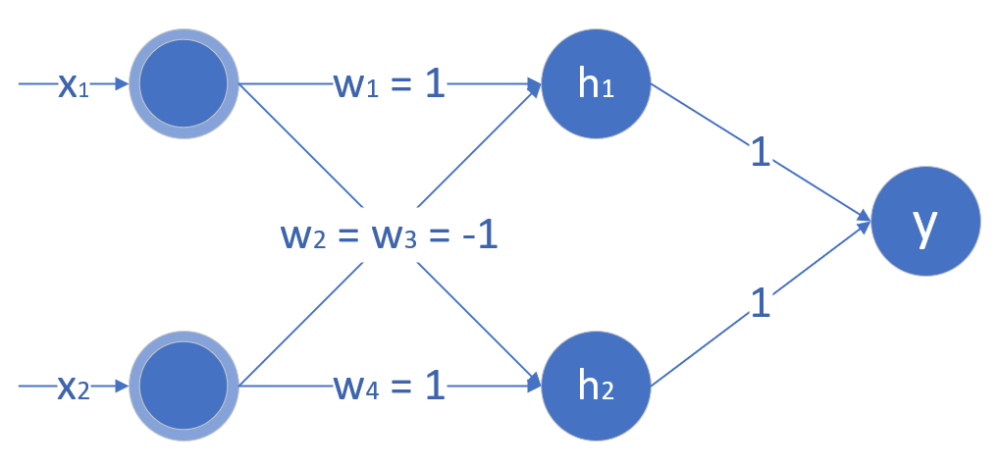

### T1
$$

\therefore \log P(y^{(i)} = k) = \beta_k x_i - \log Z\\
\therefore P(y^{(i)} = k) = \frac{e^{\beta_k x_i}}{Z}\\
设进行n分类，则有\sum^n_{k = 1} P(y^{(i)} = k) = 1\\
\therefore Z = \sum^k_{k = 1}e^{\beta_k x_i}\\
\therefore P(y^{(i)} = k) = \frac{e^{\beta_k x_i}}{\sum^k_{k = 1}e^{\beta_k x_i}}为softmax回归模型\\
$$

### T2

1. 

   下列表验证上述单元进行“与或”运算正确性：

   | $x_1$ | $x_2$ | $h_1$ | $h_2$ | $y$  |
   | :---: | :---: | :---: | :---: | :--: |
   |   0   |   0   |   0   |   0   |  0   |
   |   0   |   1   |  -1   |   1   |  1   |
   |   1   |   0   |   1   |  -1   |  1   |
   |   1   |   1   |   0   |   0   |  0   |

   由上表可知，本网络完全满足题目要求[诶个神经元的激活函数均为ReLU]

2. $$
   由于线性运算的结果仍为线性，\\
   因此，线性全连接层结合线性激活函数得到的最终输出仍为输入变量的线性变换，\\
   且不会出现交叉项，可以写为下式：\\
   y = ax_1 + bx_2 + m\\
   由异或运算的性质，或结合坐标图的对角线性质分析可知，\\
   不存在一条线性曲线可以满足异或运算的分类要求。
   $$

### T4

1. $$
   \begin{align}
   &i_1 = 0.05,  i_2 = 0.10\\
   &h_1 = \frac{1}{1 + e^{-(i_1 \times w_1 + i_2 \times w_3 + b_1)}} = 0.5933 \\
   &h_2 = \frac{1}{1 + e^{-(i_1 \times w_2 + i_2 \times w_4 + b_1)}} = 0.5969\\
   &o_1 = \frac{1}{1 + e^{-(h_1 \times w_5 + h_2 \times w_7 + b_2)}} = 0.7401\\
   &o_2 = \frac{1}{1 + e^{-(h_1 \times w_6 + h_2 \times w_8 + b_2)}} = 0.7729\\
   \end{align}
   $$

2. $$
   \begin{align}
   o_1' &= \frac{1}{1 + e^{-(h_1 \times w_5 + h_2 \times w_7 + b_2)}}\\
   o_2' &= \frac{1}{1 + e^{-(h_1 \times w_6 + h_2 \times w_8 + b_2)}}\\
   e &= 0.5(o_1 - o_1')^2 + 0.5(o_2 - o_2')^2\\
   \frac{d e}{do_1'} &= (o_1' - o_1), 
   \frac{d e}{do_2'} = (o_2' - o_2)\\
   \frac{d o_1'}{d z_1} &= o_1'(1 - o_1'), \frac{d  o_1'}{d z_2} = o_2'(1 - o_2')\\
   \frac{d z_1}{d w_5} &= h_1, \frac{d z_2}{d w_6} = h_1\\
   \frac{de}{dw_5} &= \frac{de}{do_1'}\frac{d o_1'}{d z_1}\frac{d z_1}{d w_5} = h_1o_1'(o_1' - o_1)(1 - o_1') = 0.0708\\
   \frac{de}{dw_6} &= \frac{de}{do_2'}\frac{d o_2'}{d z_2}\frac{d z_2}{d w_6} = h_2o_2'(o_2' - o_2)(1 - o_2') = -0.0186\\
   \end{align}
   $$

3. $$
   w_5^* = w_5 - \alpha \times \frac{de}{dw_5} = 0.2929\\
   w_6^* = w_6 - \alpha \times \frac{de}{dw_6} = 0.5019\\
   $$

   
