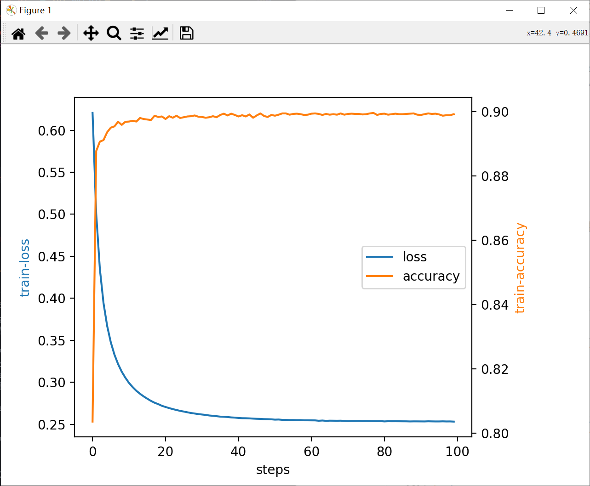
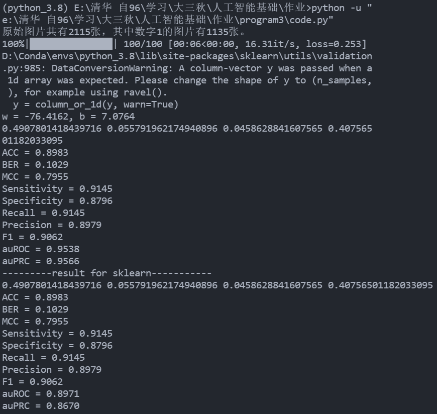

<h2  align = "center" >人工智能基础第三次编程<br> 实验报告 </h2>

<h6 align = "center">自96 曲世远 2019011455</h6>

### 1.作业要求

本次编程作业要求使用手写数字图片中的白色像素数量作为每个数据点的特征值，进行Logistic回归计算，并利用梯度下降算法得到较优的模型，并对模型进行评价。

### 2.理论计算

*推导使用随机梯度下降法求解**一元Logistic回归**的过程：*
$$
\begin{align}
z &= wx + b\\
h &= \frac{e^z}{1 + e^z}\\
e &= -y\log h- (1 - y)\log (1 - h)
\end{align}
$$

$$
\begin{align}
\frac{{\rm d} e}{{\rm d} h} &= -\frac{y}{h} + \frac{1 - y}{1 - h} = \frac{h - y}{h(1 - h)}\\
\frac{{\rm d}h}{{\rm d}z} &= \frac{e ^ z}{(1 + e ^ z)^2} = h(1 - h)\\
\frac{\partial z}{\partial b} &= 1,\frac{\partial z}{\partial w} = x\\
\frac{\partial e}{\partial b} &= h - y\\
\frac{\partial e}{\partial w} &= (h - y)x\\
\end{align}
$$


### 2.算法实现

**训练部分：**

```python
def train(w, b, X, Y, alpha=0.1, epochs=50, batchsize=32):
    """
    Input random parameters w, b and features:X labels:Y\\
    Set the parameters alpha as learning rate, epochs and batchsize\\
    return trained w, b and recording the train loss and accuracy

    """
    loss = np.zeros(epochs)
    acc = np.zeros(epochs)
    with tqdm(total = epochs) as t:
        for i in range(epochs):
            '''split the dataset'''
            random.seed(i)
            index = [i for i in range(X.shape[0])]
            random.shuffle(index)
            X = X[index]
            Y = Y[index]
            '''train'''
            acc_sum = 0
            loss_sum = 0
            for k in range(X.shape[0] // batchsize):
                X_ = X[k * batchsize : (k + 1) * batchsize]
                Y_ = Y[k * batchsize : (k + 1) * batchsize]
                Z = np.dot(w, X_) + b
                H = np.power(np.e, Z) / (1 + np.power(np.e, Z))
                Z_ = H > 0.5
                Y__ = Y_ == 1
                acc_sum += (np.sum(Z_ * Y__) + np.sum(~Z_ * ~Y__)) / batchsize
                Deltab  = np.mean(H - Y_)
                Deltaw = np.mean(np.dot(H - Y_, X_))   
                loss_sum += np.mean(-Y_ * np.log(H) - (1 - Y_) * np.log(1 - H))             
                if k == X.shape[0] // batchsize - 1:
                    acc[i] = acc_sum / (k + 1)
                    loss[i] = loss_sum / (k + 1)
                    t.set_postfix(loss = loss_sum / (k + 1))
                    t.update(1)
                w = w - Deltaw * alpha
                b = b - Deltab * alpha
                
    return w, b, loss, acc
```

以上函数为训练函数，主要就是在batch内使用上一部分推导得到的梯度对参数$w, b$进行梯度下降运算，同时记录训练过程中的loss与accuracy。

训练过程中的loss曲线与accuracy曲线如下图所示：



**测试部分：**

```python
def test(w, b, X, Y, threshold):
    """
    Use trained parameters w, b with testfeature:X, test_labels:Y to evaluate the model
    """
    print("w = %.4f, b = %.4f" % (w, b))
    Z = np.dot(w, X) + b
    H = np.power(np.e, Z) / (1 + np.power(np.e, Z))
    index_z_1 = (H > threshold)
    index_z_0 = (H < threshold)
    index_y_1 = (Y == 1)
    index_y_0 = (Y == 0)
    TP = np.sum(index_z_1 * index_y_1) / H.shape[0]
    FP = np.sum(index_z_1 * index_y_0) / H.shape[0]
    FN = np.sum(index_z_0 * index_y_1) / H.shape[0]
    TN = np.sum(index_z_0 * index_y_0) / H.shape[0]
    print(TP, FP, FN, TN)
    # Accuracy
    ACC = (TP + TN) / (TP + TN + FP + FN)
    # Balances error rate
    BER = 0.5 * (FP / (FP + TN) + FN / (FN + TP))
    # Matthew's correlation coefficient
    MCC = (TP * TN - FP * FN) / np.power((TP + FP) * (FP + TN) * (TN + FN) * (FN + TP), 0.5)
    # Sensitivity
    Sensitivity = TP / (TP + FN)
    # Specificity
    Specificity = TN / (TN + FP)
    # Recall
    Recall = TP / (TP + FN)
    # Precision
    Precision = TP / (TP + FP)
    # F1-measure
    F1 = 2 * Precision * Recall / (Precision + Recall)
    # auROC
    auROC = metrics.roc_auc_score(Y, Z)
    # auPRC
    auPRC = metrics.average_precision_score(Y, Z)
```

以上代码为我的评价函数，主要是针对模型给出的预测结果与真实标签做对比并依据诸多参数给出评价。在$epochs = 100, alpha = 0.05, bathcsize = 16$时，同时与sklearn的效果进行对比如下：

|              评价指标               | My Model | sk-learn |
| :---------------------------------: | :------: | :------: |
|              Accuracy               |  0.8983  |  0.8983  |
|         Balance error rate          |  0.1029  |  0.1029  |
| Matthew's correlation ccoeffiecient |  0.7955  |  0.7955  |
|             Sensitivity             |  0.9145  |  0.9145  |
|             Specificity             |  0.8796  |  0.8796  |
|               Recall                |  0.9145  |  0.9145  |
|              Precision              |  0.8979  |  0.8979  |
|             F1-measure              |  0.9062  |  0.9062  |
|                auROC                |  0.9538  |  0.8971  |
|                auPRC                |  0.9566  |  0.8670  |



下面代码为我使用sklearn部分的代码：

```python
def train_sklearn(X, Y, X_test, epochs):
    #print(X.shape, Y.shape, X_test)
    skmodel = LogisticRegression(penalty = 'none', max_iter = epochs)
    skmodel.fit(X.reshape(-1, 1), Y.reshape(-1, 1))
    Z = skmodel.predict(X_test.reshape(-1, 1))
    return Z

def test_sklearn(Z, Y, threshold):
    print("---------result for sklearn-----------")
    index_z_1 = (Z > threshold)
    index_z_0 = (Z < threshold)
    index_y_1 = (Y == 1)
    index_y_0 = (Y == 0)
    TP = np.sum(index_z_1 * index_y_1) / Z.shape[0]
    FP = np.sum(index_z_1 * index_y_0) / Z.shape[0]
    FN = np.sum(index_z_0 * index_y_1) / Z.shape[0]
    TN = np.sum(index_z_0 * index_y_0) / Z.shape[0]
    print(TP, FP, FN, TN)
    # Accuracy
    ACC = (TP + TN) / (TP + TN + FP + FN)
    print("ACC = %.4f" % ACC)
    # Balances error rate
    BER = 0.5 * (FP / (FP + TN) + FN / (FN + TP))
    print("BER = %.4f" % BER)
    # Matthew's correlation coefficient
    MCC = (TP * TN - FP * FN) / np.power((TP + FP) * (FP + TN) * (TN + FN) * (FN + TP), 0.5)
    print("MCC = %.4f" % MCC)
    # Sensitivity
    Sensitivity = TP / (TP + FN)
    print("Sensitivity = %.4f" % Sensitivity)
    # Specificity
    Specificity = TN / (TN + FP)
    print("Specificity = %.4f" % Specificity)
    # Recall
    Recall = TP / (TP + FN)
    print("Recall = %.4f" % Recall)
    # Precision
    Precision = TP / (TP + FP)
    print("Precision = %.4f" % Precision)
    # F1-measure
    F1 = 2 * Precision * Recall / (Precision + Recall)
    print("F1 = %.4f" % F1)
    # auROC
    auROC = metrics.roc_auc_score(Y, Z)
    print("auROC = %.4f" % auROC)
    # auPRC
    auPRC = metrics.average_precision_score(Y, Z)
    print("auPRC = %.4f" % auPRC)
```

