<h2  align = "center" >人工智能基础第四次编程<br> 实验报告 </h2>

<h6 align = "center">自96 曲世远 2019011455</h6>

### 1.作业要求

本次编程作业要求使用原图片解决十分类问题。

### 2.算法实现

**训练部分：**

```python
train_dataset = MNISTDataset(train=True)
trainloader = torch.utils.data.DataLoader(train_dataset, batch_size=args.batch_size,
                                         shuffle=True, drop_last=True)

test_dataset = MNISTDataset(train=False)
testloader = torch.utils.data.DataLoader(test_dataset, batch_size=args.batch_size,
                                        shuffle=False, drop_last=False)

device = torch.device("cuda:0" if torch.cuda.is_available() else "cpu")
if args.method == 'softmax':
    net = SoftmaxModel().to(device)
elif args.method == 'linear':
    net = LinearModel().to(device)
elif args.method == 'conv':
    net = ConvModel().to(device)

optimizer = optim.Adam(net.parameters(), lr=args.lr, weight_decay=1e-5)
criterion = nn.CrossEntropyLoss().to(device)
net = net.to(device)
steps = 0
best_acc = 0
train_acc_for_plt = np.zeros(args.nepoch)
test_acc_for_plt = np.zeros(args.nepoch)

print("Training", args.name, "on", device)

for epoch in range(args.nepoch):

    '''begin training'''
    total_num = 0
    total_correct = 0
    total_train_loss = 0
    num_batch = len(trainloader)
    net.train()

    print('Training Epoch [%d/%d]' % (epoch, args.nepoch))

    for idx, (image, label) in enumerate(trainloader, 0):
        steps += 1
        image, label = Variable(image), Variable(label)
        image, label = image.cuda(device), label.cuda(device)

        optimizer.zero_grad()
        pred = net(image)

        loss = criterion(pred, label)
        loss.backward()
        optimizer.step()

        total_train_loss += loss.item()
        _, pred = pred.max(1)
        total_num += label.size(0)
        total_correct += pred.eq(label).sum().item()

        if idx % 100 == 0:
            accuracy = 100. * total_correct / total_num
            """ print('Train[%d: %d/%d] loss: %.6f accuracy: %.6f' % (epoch, idx, num_batch, total_train_loss / (idx + 1), accuracy)) """
            train_acc_for_plt[epoch] = accuracy

    '''begin evaluating'''
    total_num = 0
    total_correct = 0
    total_test_loss = 0
    net.eval()

    
    """     print('Evaluating Epoch [%d/%d]' % (epoch, args.nepoch)) """

    for idx, (image, label) in enumerate(testloader, 0):
        with torch.no_grad():
            image, label = image.to(device), label.to(device)
            pred = net(image)

        _, pred = pred.max(1)
        total_num += label.size(0)
        total_correct += pred.eq(label).sum().item()

    test_acc = 100. * total_correct / total_num
    if test_acc > best_acc:
        best_acc = test_acc

    """ print('test accuracy: %.6f, best accuracy: %.6f' % (test_acc, best_acc)) """
    test_acc_for_plt[epoch] = test_acc
```

上述代码为训练部分的代码，根据`args`设定的参数以及网络参数训练模型。我的网络设计如下：（依据三问的不同要求分别设计了softmax, linear,conv）

因为`pytorch`中的交叉熵损失会在网络进行分类时自动进行softmax计算，所以可以采用如下的网络结构分别实现三问的要求：

```python
class SoftmaxModel(nn.Module):
    def __init__(self):
        super(SoftmaxModel, self).__init__()
        self.fc = nn.Linear(784, 10) # B, 784 -> B, 10

    def forward(self, x):
        x = self.fc(x)
        return x

class LinearModel(nn.Module):
    def __init__(self):
        super(LinearModel, self).__init__()
        self.fc = nn.Sequential(
            nn.Linear(784, 1024),
            nn.BatchNorm1d(1024),
            nn.ReLU(),
            nn.Linear(1024, 2048),
            nn.BatchNorm1d(2048),
            nn.ReLU(),
            nn.Linear(2048, 2048),
            nn.BatchNorm1d(2048),
            nn.ReLU(),
            nn.Dropout(0.1),
            nn.Linear(2048, 10)
        )

    def forward(self, x):
        x = self.fc(x)  # B, 784 -> B, 10
        return x

class ConvModel(nn.Module):

    def __init__(self):
        super(ConvModel, self).__init__()
        self.conv1 = nn.Sequential(
            nn.Conv2d(1, 32, kernel_size=3, stride=1, padding=1),
            nn.Conv2d(32, 32, kernel_size=3, stride=1, padding=1),
            nn.BatchNorm2d(32),
            nn.ReLU(),
            nn.MaxPool2d(2, 2)
        )
        self.conv2 = nn.Sequential(
            nn.Conv2d(32 ,64, kernel_size=3, stride=1, padding=1),
            nn.Conv2d(64, 64, kernel_size=3, stride=1, padding=1),
            nn.BatchNorm2d(64),
            nn.ReLU(),
            nn.MaxPool2d(2, 2)
        )
        self.linearfc = nn.Sequential(
            nn.Linear(64*7*7, 1024),
            nn.BatchNorm1d(1024),
            nn.ReLU(),
            nn.Linear(1024, 2048),
            nn.BatchNorm1d(2048),
            nn.ReLU(),
            nn.Linear(2048, 2048),
            nn.BatchNorm1d(2048),
            nn.ReLU(),
            nn.Dropout(0.1),
            nn.Linear(2048, 10)
        )

    def forward(self, x):
        B = x.size(0)
        x = x.view(B, 28, 28).unsqueeze(1) # B, 784 -> B, 1, 28, 28
        x = self.conv1(x) # B, 32, 14, 14
        x = self.conv2(x) # B, 64, 7, 7
        x = x.view(B, -1)
        x = self.linearfc(x) #B, 64*7*7, 10
        return x

```

基于以上网络的训练过程如下图所示：（softmax， linear， conv）

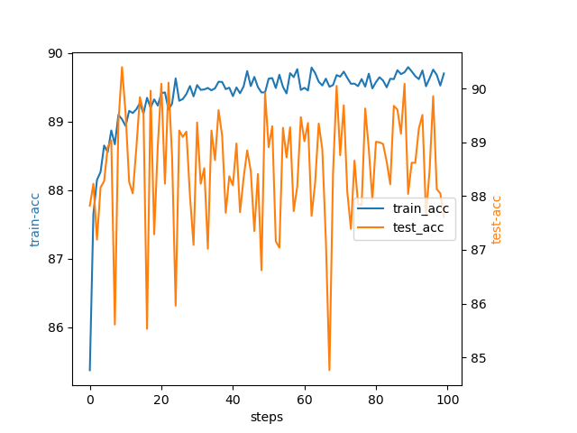

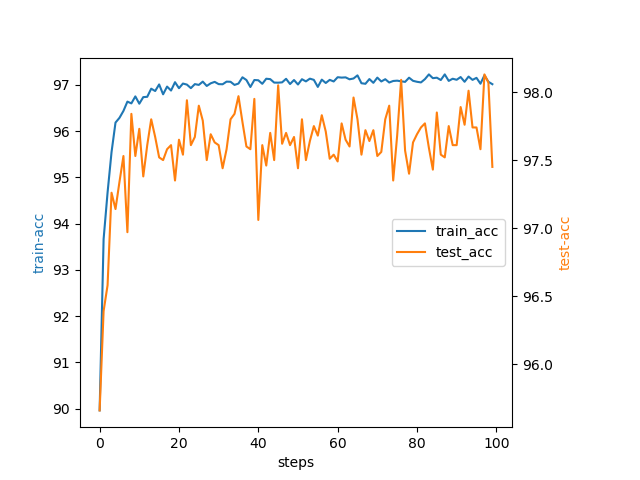

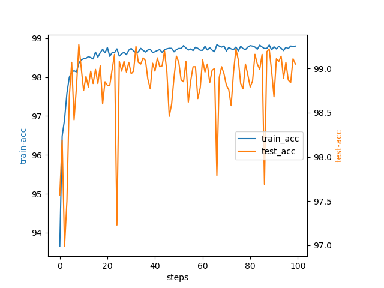

可以看到整体精确度呈现上升趋势并且最终准确度较高，由于准确度的波动范围很小，因此在图形上看起来波动较大，但实际上是在较小范围内的正常波动。

通过评价函数以及绘制auROC和auPRC曲线图，可以评价三个模型的性能如下：

|    评价指标     | Softmax | Linear |  Conv  |
| :-------------: | :-----: | :----: | :----: |
|  Accuracy of 0  |  96.77  | 96.77  |  100   |
|  Accuracy of 1  |  98.02  | 98.87  | 99.15  |
|  Accuracy of 2  |  86.24  | 98.17  |  100   |
|  Accuracy of 3  |  90.32  | 95.48  | 99.35  |
|  Accuracy of 4  |  90.00  | 96.45  | 98.06  |
|  Accuracy of 5  |  87.50  | 98.93  | 99.29  |
|  Accuracy of 6  |  97.00  | 99.00  | 97.67  |
|  Accuracy of 7  |  82.81  | 96.88  | 99.06  |
|  Accuracy of 8  |  78.00  | 97.00  | 98.67  |
|  Accuracy of 9  |  87.81  | 98.13  | 99.38  |
| precision_micro | 0.8971  | 0.9764 | 0.9910 |
| precision_macro | 0.8972  | 0.9765 | 0.9910 |
|  recall_micro   | 0.8971  | 0.9764 | 0.9910 |
|  recall_macro   | 0.8961  | 0.9762 | 0.9909 |
|    F1_micro     | 0.8971  | 0.9764 | 0.9910 |
|    F1_macro     | 0.8954  | 0.9763 | 0.9909 |
|       MCC       | 0.8959  | 0.9738 | 0.9900 |

**分类评价阵与auROC/auPRC曲线：**

softmax：

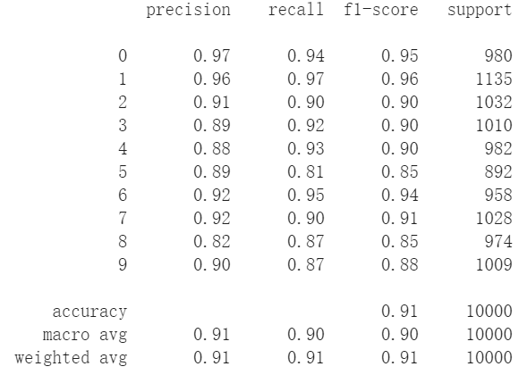

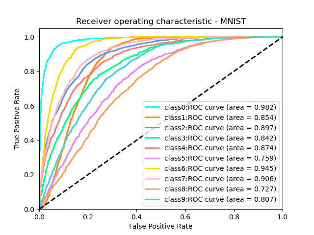

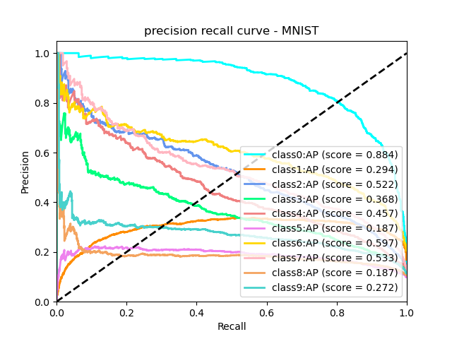

linear：

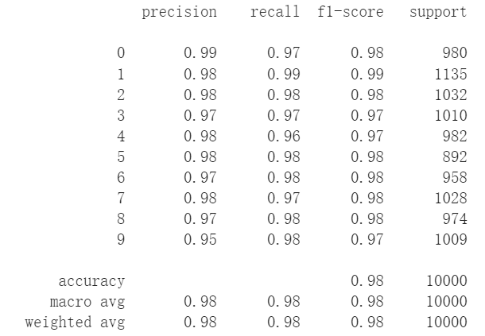

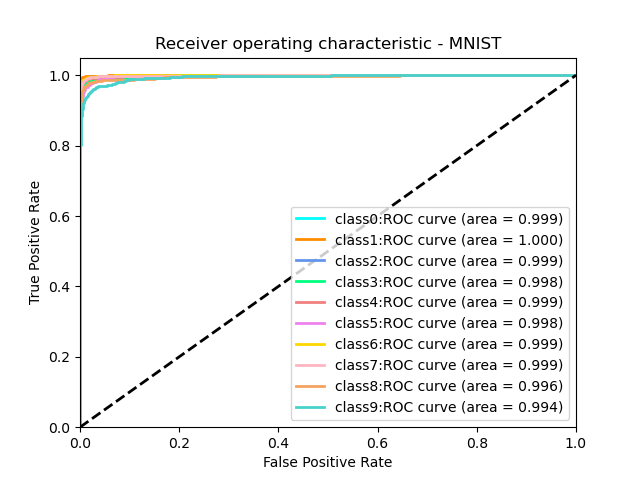

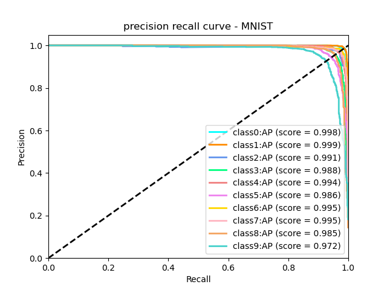

conv：

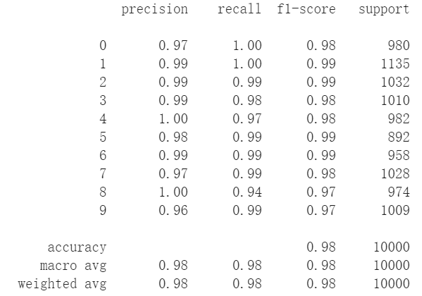

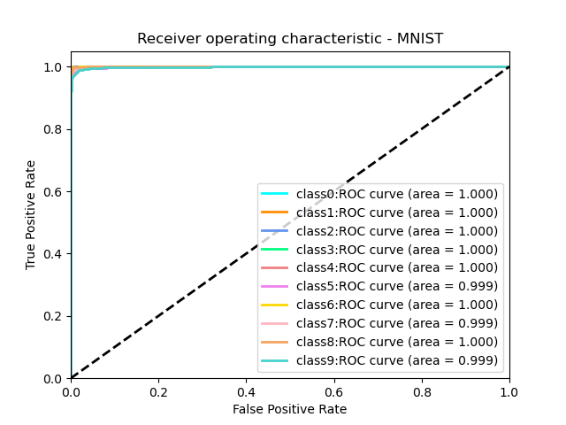

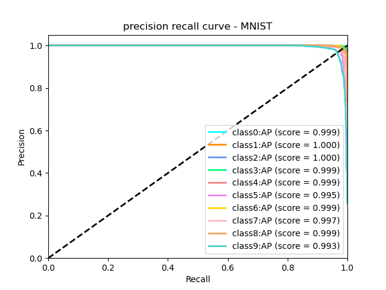

