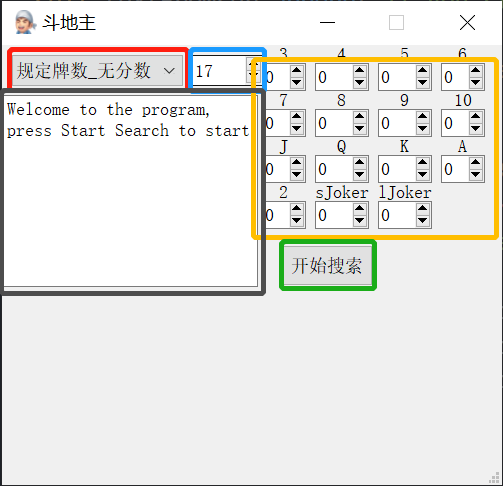
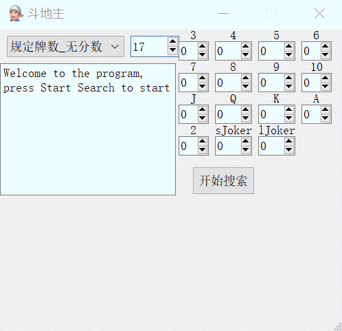
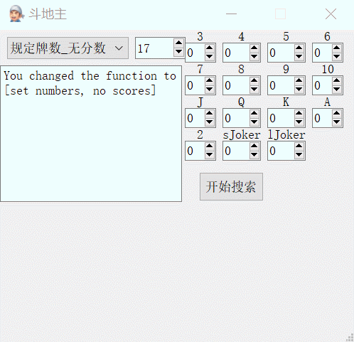
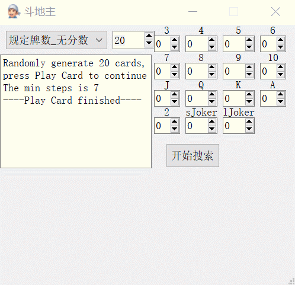
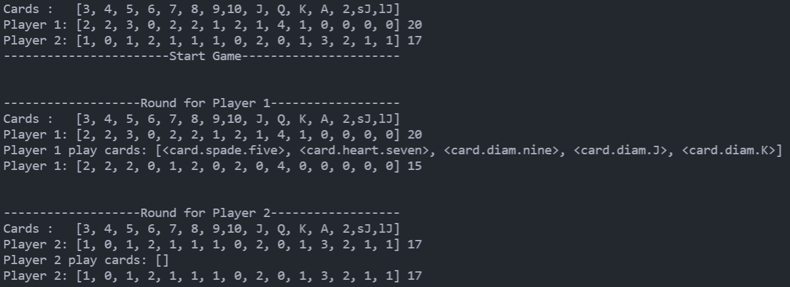
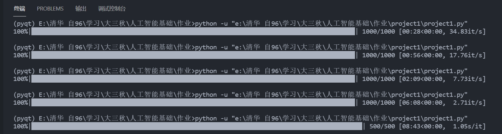
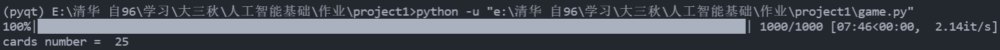

<h2  align = "center" >人工智能基础<br>第一次大作业报告 </h2>

<h6 align = "center">自96 曲世远 2019011455</h6>

### 0.使用说明

#### 0.1 UI使用说明

将`release1_12`文件夹解压缩后找到`project1_ui.exe`文件，双击exe开始运行后，稍微等待几秒钟等待应用程序初始化。

我设计的ui界面实现了针对第一第二问的两种出牌要求以及两种选牌方式的四种功能：

1. 给定输入牌数，随机生成一副手牌并计算最少出牌次数；
2. 生成指定的手牌，并计算所需的最小出牌次数；
3. 给定输入牌数，随机生成一副手牌并计算可获得的最高出牌分数；
4. 生成指定的手牌，并计算可获得的最高出牌分数。



如上图所示，**红色方框**处的下拉框可用于**调整功能**，**蓝色方框**处可以用来调整**指定的牌数多少**，**黄色方框**处用于指定手牌中的**每种码数的牌有多少张**，**绿色方框**处的按钮用于**开始搜索**，**黑色方框**中的提示信息用于**显示必要的数据与提示**。使用示例如下所示：

**使用功能1**~给定输入牌数，随机生成一副手牌并计算最少出牌次数~



**使用功能2**~生成指定的手牌，并计算所需的最小出牌次数~



**使用功能3**~给定输入牌数，随机生成一副手牌并计算可获得的最高出牌分数~



**使用功能4**~生成指定的手牌，并计算可获得的最高出牌分数~


#### 0.2 第三问代码使用说明

可以通过直接运行`dgame.py`文件，或是解压缩`release1_3`运行`dgame.exe`程序，稍等几秒程序初始化后即可使用。

运行代码后，可以指定Player1和Player2的手牌数目，根据提示输入即可，之后会有提示等待程序初始化。计算之后，程序会逐回合的输出双方的出牌以及当前手牌与数量，具体见下：


之后会生成两个人的手牌，并自动开始游戏，Player1会和Player2轮流出牌，每次出牌时，会输出四行分别是：手牌码数，码数对应的牌数，本次回合出的牌，出牌后剩余的手牌牌数。



在结束一局游戏后，会提示输入[y/n]继续游戏或是退出程序。


### 1.算法设计说明

#### 1.1单人游戏模式下的算法设计

​	本大作业中的单人游戏模式只涉及到出牌的速度（或激励）的大小，并不涉及到博弈以及其他更深层次的考量，因此可以基于DFS算法进行适度优化。

​	分析题目不难发现，题目中的出牌方式可以统一分为顺子与带牌两种类型。采用这种分类方式是因为带牌无需考虑不同码数之间的联系，然而顺子必须考虑牌的码数是否相邻，较难简化搜索。

​	基于此，本题目可转化为两个子问题，一副手牌只出顺子怎么出最快，只出带牌与对子，单牌怎么出最快。

​	首先解决第二个问题：由于带牌的问题不需要考虑牌的码数大小，所以可以将手牌整理为共有几个码数的牌有1，2，3，4张的情况，之后利用动态规划的递推式先求解针对每一种手牌组成的最快出牌次数：

```python
dp[a][b][c][d][e] = min(x, dp[a - a0][b - b0][c - c0][d - d0][e - e0])#根据不同的出牌方式设置参数
```

​	这样就得到了一个针对不同牌型的dp数组，可以在$O(1)$的时间内获得带牌出牌方式的最小剩余步数；

​	接下来考虑顺子的搜索方式：由于顺子的长度不定，初始码数不定，因此很难通过其他信息提高搜索效率，因此我才用了普通的DFS算法搜索顺子的情况。

​	整合以上两个子问题的解决方式，**我最后采用的就是先通过DFS搜索顺子的出牌方式，DFS每深入一层，再使用预处理得到的DP数组进行剪枝判断**。基于此算法，本问题的复杂度完全集中到了顺子问题的DFS处理上，因此在对大数量牌的出牌方式计算上具有很大的优势。

​	针对考虑分数的第二问，只需要在第一问的算法上调整DP剪枝的环节为计算$score$也可以起到加快收敛速度与加速的效果，算法的设计思路与第一问整体相同。

#### 1.2**模拟对战游戏模式下的算法设计**

​	本部分的算法主要分为应对出牌与主动出牌两部分：

​	应对出牌部分只需要考虑自己的牌中是否有相同类型的出牌方式，如果搜索到有，则出相同类型中最小的一个即可；

​	主动出牌的情况中我复用了单人模式中的搜索最快出牌的方式，我算法的逻辑是，如果我可以主动出牌，那么搜索如何我自己才能最快的将一副牌出完，在这种情况下挑选最有价值的出牌方式优先出。

​	基于以上的逻辑，我实现了比较有效的模拟对战策略。

### 2.算法效率分析

为了有更加直观的比较结论，我主要针对本次作业的第一小问（第一小问与第二小问的算法设计区别不大，而第二小问验证难度稍大，故采用第一小问验证效率）进行算效率验证。

为了更直观的进行比较，我主要与完全DFS搜索的效率进行比较：

【比较方式为进行随机500-1000iters的出牌方式搜索计算，通过tqdm模块获取平均的搜索时间】

下图为**完全DFS算法**对于手牌数量为17， 18， 19， 20， 21张时的运行效率，可以发现完全DFS算法在20张牌左右进行运算时，平均计算时间随手牌数的增长呈现指数次的增长，而在20张牌以上的情况时，这种增长速度进一步提高，大概在25张手牌左右时，就会出现$min/iter$的计算时间，基本无法在短时间内解决30张手牌以上的问题。

分析这一现象的原因，主要是由于一幅手牌共有15种牌，而在手牌数量达到15张以上时，顺子的出现几率随牌数的增加大幅提高，从而导致了分支因子的陡然增大。而在25张牌以上时，双顺子与各种带牌的情况变得更加复杂，分支因子呈现爆炸性增长，完全DFS无法处理如此高的分支因子带来的复杂性。



而对于应用了DP剪枝的DFS算法（即我采用的算法），可以轻松的应付25张手牌以下的问题：



然而在计算运行中我也观察到其出现的偶尔卡顿现象，究其原因是由于部分随机出的牌型具有对于顺子来说较大的分支因子，如连续码数都具有的多张手牌，由于我的顺子部分的搜索仍旧采用的是DFS搜索方式，因而在处理此类情况时效率仍旧较低。

